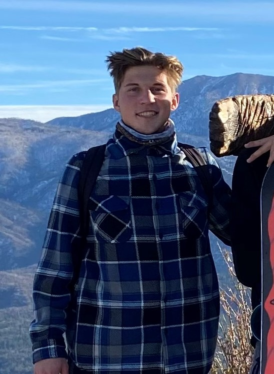

# **Hello, World! My name is Kevin Dyblie**



# A Little About Me

I am from [Oceanside](https://visitoceanside.org/), California, born and raised! I went to Mission Vista High School and graduated in 2018. I am currently a student at University of California - San Diego studying Mathematics - Computer Science. Some of my hobbies are skiing, gaming, and during the summer I'm probably at the beach. During my time in highschool I was fascinated with mathematics, considering pursuring pure math in college. However, during my senior year I was introduced to the world of programming and opted to shift my direction. I started programming my first year of college and looking back have been pleased that I took the leap of faith to do so! Since starting at UCSD I catch my self reciting what appears to be the Professors of the CSE departments favorite saying:
> Start early, start often!

## Favorite TV Shows
1. Breaking Bad 
2. Narcos
3. Narcos Mexico
4. F is for Family

## Favorite Games
1. The Legend of Zelda: The Wind Waker
2. Insurgency: Sandstorm
3. Rust
4. Call of Duty Modern Warfare

## Programming Languages Used
 - C++
 - C
 - Java

## Some Of My Favorite Classes At UCSD
- CSE 100 - Advanced Data Structures
- Math 184 - Enumerative Combinatorics
- CSE 105 - Theory of Computation
- HIEU 128 - Europe since 1945

Some basic the commandline commands:
- mkdir - creates a new directory in the current working directory
```
mkdir <directoryName>
```
- touch - creates a new file in the working directory
```
touch <fileName>
```
How to write good code?
- [x] Documentation
- [x] Consistent Name Scheme
- [x] Delete Unnecessary Code
- [x] Maximize Efficiency of Code
- [ ] Browse Reddit
- [x] Coffee!

Want to know my favorite programming langauge? [Click here!](README.md)

[Return to Top of Page](#hello-world-my-name-is-kevin-dyblie)